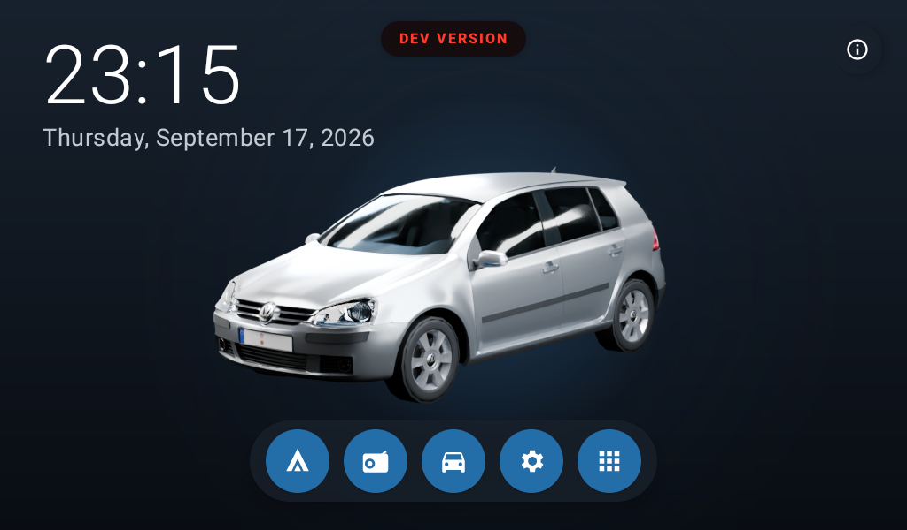

# Golf Mk5 + QC4250

Reverse-engineering notes for the Android head unit in a Volkswagen Golf Mk5.



## Passwords

- Factory Settings: `8888`
- Hidden Engineering / Developer options on this SM4250 unit: `y4250x`

## Current work

We are identifying OEM apps and dependencies so the unit can be simplified for
Android Auto while preserving the launcher, CAN bus, and rear camera. The TXZ
robot overlay disappeared after disabling `com.txznet.txz`; restore it with:

```sh
adb shell pm enable --user 0 com.txznet.txz
```

See [AGENTS.md](./AGENTS.md) for the verified component map and findings.

## Dependencies

The Android launcher is built with Kotlin, Jetpack Compose, and Gradle. The
Gradle wrapper downloads its pinned Gradle version, and `make setup` downloads
the Android SDK, build tools, platform tools, Android 11 system image, and
emulator into ignored project directories. You do not need Android Studio or a
system-wide Android SDK.

### Arch Linux

Install the host tools required by the setup script and build:

```sh
sudo pacman -S --needed jdk17-openjdk curl unzip coreutils make
```

Make Java 17 the active Java installation if you have multiple JDKs:

```sh
sudo archlinux-java set java-17-openjdk
java -version
```

Then from the repository root, install the project-local Android toolchain:

```sh
make setup
```

Review and accept the Android SDK licenses when prompted. After setup,
`make run` builds and runs the debug launcher in the configured emulator.
Internet access is needed for the initial SDK and Gradle downloads.

The emulator uses KVM acceleration when `/dev/kvm` is available and falls back
to slower software rendering otherwise. For KVM, enable hardware virtualization
in firmware, use a kernel with KVM support, and grant your user access to the
`kvm` group (log out and back in after changing group membership). The emulator
can still run without KVM, but more slowly. Physical-device installs use the
ADB binary downloaded by `make setup`; wireless debugging must already be
paired and connected.

### Optional 3D asset tools

The separate Blender rendering workspace under `rendering/golf_mk5/` uses
Blender for scene rendering and FFmpeg for video encoding. These are not needed
to build or run the Android launcher. Install them on Arch only when working
on those assets:

```sh
sudo pacman -S --needed blender ffmpeg
```

GPU rendering also requires a supported GPU and the matching driver/runtime;
the rendering script reports an error if Blender cannot use one.

## Launcher development

The custom launcher plan is documented in [LAUNCHER.md](./LAUNCHER.md). The
project uses a local Android 11 emulator configured like the head unit:
1024×600, landscape, 160 dpi, and 60 Hz.

Install the local Android toolchain and create the emulator once:

```sh
make setup
```

For the normal development loop, start the emulator, compile the APK, install
it, and launch the application with:

```sh
make run
```

The individual operations are also available:

```sh
make start       # Open the graphical Android emulator
make build       # Compile the separate debug app
make run         # Build, install, and launch debug on the emulator
make build-stable # Compile stable mode with R8 and resource shrinking
make run-stable  # Build, install, and launch stable mode on the emulator
make test        # Run the Compose UI tests and restore the debug app afterward
make install     # Install the existing debug APK on the emulator
make install-stable DEVICE=SERIAL # Build and install stable mode on a device
make launch      # Launch the installed app on the emulator
make launch-stable DEVICE=SERIAL # Launch stable mode on a device
make stop        # Stop the emulator
make doctor      # Check Java, SDK, KVM, APK, and connected ADB devices
make help        # Show every available command
```

The normal development commands build a separate app named **Golf Mk5 Debug**.
It has package `com.golfv.launcher.debug`, cannot become the HOME app, and is
safe to install beside the stable launcher. The generated APK is located at:

```text
app/build/outputs/apk/debug/app-debug.apk
```

`make run` builds the debug app (`com.golfv.launcher.debug`). The stable build
uses R8, resource shrinking, and the local debug signing key for device
testing. It uses the stable package `com.golfv.launcher` and replaces the
previous stable installation. Build and install it on an emulator with
`make run-stable`; on a tablet, use:

```sh
make install-stable DEVICE=DEVICE_SERIAL
make launch-stable DEVICE=DEVICE_SERIAL
make set-home-stable DEVICE=DEVICE_SERIAL  # optional: select it as HOME
```

`make doctor` lists connected ADB device serials. `make install-stable` builds
the R8 APK before installing it. The APK is written to
`app/build/outputs/apk/release/app-release.apk`. This
debug-signed device build is not the distributable release APK. The animated car
video is stored under `app/src/main/assets/` and loaded through
`file:///android_asset/`; R8 can rename resources in `res/`, which would break
the WebView's dynamic video URL in the minified build.

Git follows the same split: `main` contains the tested stable baseline, while
new work is committed and pushed to `dev`. Merge `dev` into `main` only after
the debug APK has passed the tablet test.

### Installing on the head unit

List the connected ADB targets and copy the exact serial of the head unit:

```sh
adb devices -l
```

Then install and launch using that explicit serial:

```sh
make install DEVICE=DEVICE_SERIAL       # debug, installed alongside stable
make launch DEVICE=DEVICE_SERIAL        # debug
make install-stable DEVICE=DEVICE_SERIAL # stable mode, minified with R8
make launch-stable DEVICE=DEVICE_SERIAL  # stable mode
make set-home-stable DEVICE=DEVICE_SERIAL
```

Without `DEVICE=...`, the Make targets default to `emulator-5554`. This avoids
accidentally installing on the car when multiple ADB devices are connected.
The debug APK does not register as a HOME handler. Selecting stable as HOME does
not disable either OEM launcher.

See [DEVELOPMENT.md](./DEVELOPMENT.md) for setup details and local generated
directories.

### Publishing an in-app update

The information page checks the repository's latest GitHub Release, downloads
its first `.apk` asset, verifies its GitHub SHA-256 digest, package name,
increasing `versionCode`, and signing certificate, then opens Android's package
installer. To publish an update:

1. increase both `versionCode` and `versionName` in `app/build.gradle.kts`;
2. build an APK signed with the same key as the APK already on the head unit;
3. create a non-draft, non-prerelease GitHub Release tagged with the same
   version (for example `v0.2.3`) and attach the APK.

If GitHub does not expose a digest for the asset, also attach a text file named
`<apk-name>.sha256` containing its SHA-256 value. Android requires a one-time
“Install unknown apps” authorization and always shows its own final install
confirmation. An APK signed with another key is rejected by the launcher and
cannot update the installed application.
