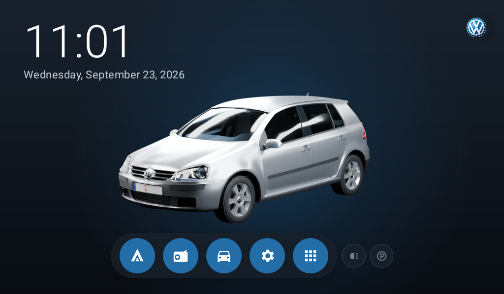
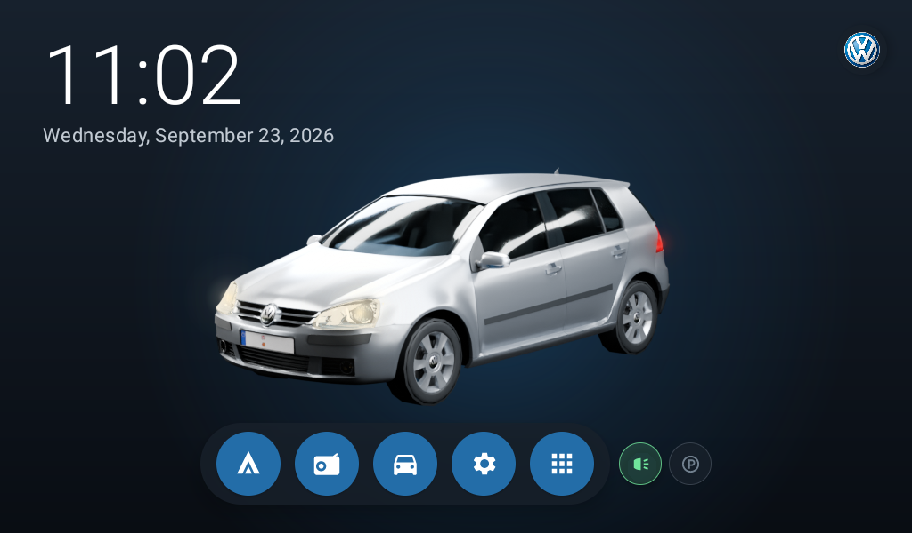
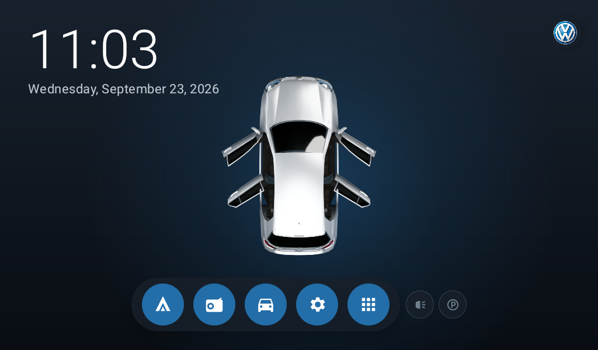
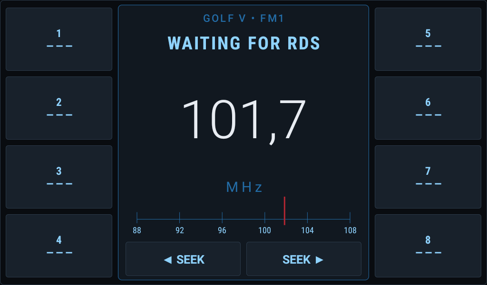
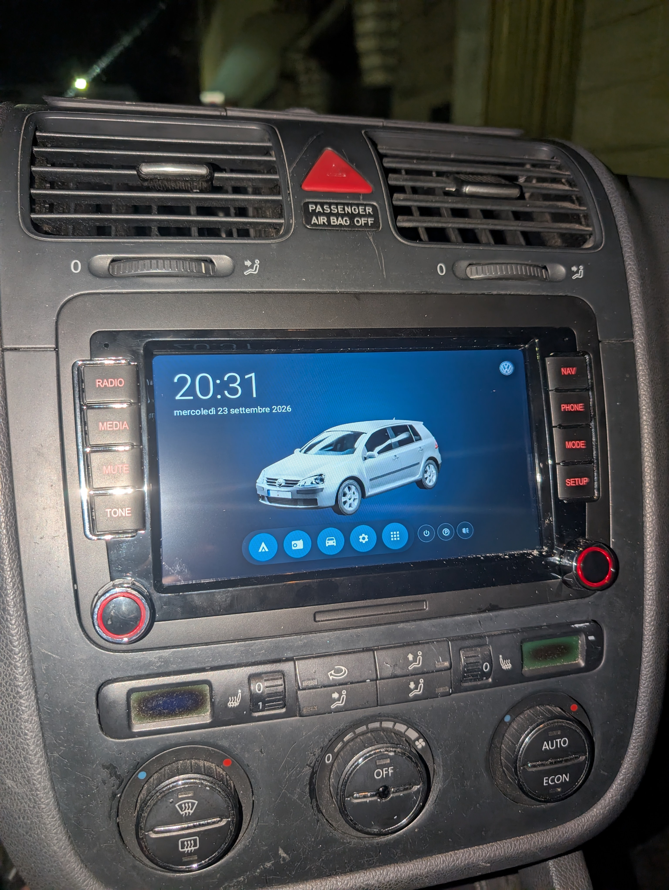
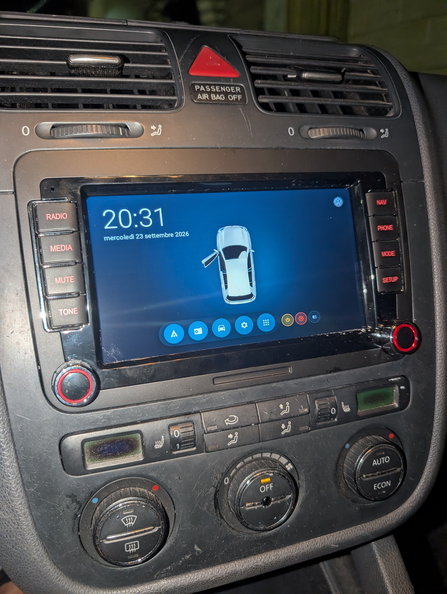

# Golf Mk5 + QC4250

Reverse-engineering notes for the Android head unit in a Volkswagen Golf Mk5.

## Emulator screenshots

Captured on the 1024×600 Android 11 emulator. The light and door states use the
launcher's visual preview controls. The radio screen shows a simulated
101.7 MHz update because the emulator does not provide the OEM tuner or RDS.

| Launcher · headlights off | Launcher · headlights on |
| --- | --- |
|  |  |
| All four doors open · tailgate closed | Radio · simulated 101.7 MHz |
|  |  |

### On-device photos

The launcher running on the QC4250 head unit installed in the Golf Mk5.

| Perspective Home view | Live CAN door and indicator view |
| --- | --- |
|  |  |

## Passwords

- Factory Settings: `8888`
- Hidden Engineering / Developer options on this SM4250 unit: `y4250x`

## Current work

We are identifying OEM apps and dependencies so the unit can be simplified for
Android Auto while preserving the launcher, CAN bus, and rear camera. The TXZ
robot overlay disappeared after disabling `com.txznet.txz`; restore it with:

```sh
adb shell pm enable --user 0 com.txznet.txz
```

See [AGENTS.md](./docs/AGENTS.md) for the verified component map and findings.

## Dependencies

The Android launcher is built with Kotlin, Jetpack Compose, and Gradle. The
Gradle wrapper downloads its pinned Gradle version, and `make setup` downloads
the Android SDK, build tools, platform tools, Android 11 system image, and
emulator into ignored project directories. You do not need Android Studio or a
system-wide Android SDK.

### Arch Linux

Install the host tools required by the setup script and build:

```sh
sudo pacman -S --needed jdk17-openjdk curl unzip coreutils make
```

Make Java 17 the active Java installation if you have multiple JDKs:

```sh
sudo archlinux-java set java-17-openjdk
java -version
```

Then from the repository root, install the project-local Android toolchain:

```sh
make setup
```

Review and accept the Android SDK licenses when prompted. After setup,
`make run` builds and installs the launcher and radio app, then opens the
production launcher in the configured emulator.
Internet access is needed for the initial SDK and Gradle downloads.

The emulator uses KVM acceleration when `/dev/kvm` is available and falls back
to slower software rendering otherwise. For KVM, enable hardware virtualization
in firmware, use a kernel with KVM support, and grant your user access to the
`kvm` group (log out and back in after changing group membership). The emulator
can still run without KVM, but more slowly. Physical-device installs use the
ADB binary downloaded by `make setup`; wireless debugging must already be
paired and connected.

### Optional 3D asset tools

The separate Blender rendering workspace under `rendering/golf_mk5/` uses
Blender for scene rendering and FFmpeg for video encoding. These are not needed
to build or run the Android launcher. Install them on Arch only when working
on those assets:

```sh
sudo pacman -S --needed blender ffmpeg
```

GPU rendering also requires a supported GPU and the matching driver/runtime;
the rendering script reports an error if Blender cannot use one.

## Launcher development

The custom launcher plan is documented in [LAUNCHER.md](./docs/LAUNCHER.md). The
project uses a local Android 11 emulator configured like the head unit:
1024×600, landscape, 160 dpi, and 60 Hz.

Install the local Android toolchain and create the emulator once:

```sh
make setup
```

For the normal development loop, start the emulator, compile and install both
apps, and launch the launcher with:

```sh
make run
```

The individual operations are also available:

```sh
make start       # Open the graphical Android emulator
make build       # Compile the launcher and radio release APKs
make run         # Build/install both apps and launch the launcher
make test        # Run the Compose UI tests and restore the production app
make install DEVICE=SERIAL # Build and install both apps on a device
make launch DEVICE=SERIAL  # Launch the installed app
make set-home DEVICE=SERIAL # Optional: select it as HOME
make stop        # Stop the emulator
make doctor      # Check Java, SDK, KVM, APK, and connected ADB devices
make help        # Show every available command
```

The production packages are **Golf Mk5** (`com.golfv.launcher`) and **Golf
Radio** (`com.golfv.radio`). Normal build and install commands include both
release APKs, signed with the local key used by the tablet:

```text
launcher-app/build/outputs/apk/release/launcher-app-release.apk
radio-app/build/outputs/apk/release/radio-app-release.apk
```

`make install` always rebuilds before installing. The animated car video is
stored under `launcher-app/src/main/assets/` and loaded through
`file:///android_asset/`; R8 can rename resources in `res/`, which would
break the WebView's dynamic video URL in the minified build.

### Installing on the head unit

List the connected ADB targets and copy the exact serial of the head unit:

```sh
adb devices -l
```

Then install and launch using that explicit serial:

```sh
make install DEVICE=DEVICE_SERIAL
make launch DEVICE=DEVICE_SERIAL
make set-home DEVICE=DEVICE_SERIAL  # optional: select it as HOME
```

Without `DEVICE=...`, the Make targets default to `emulator-5554`. This avoids
accidentally installing on the car when multiple ADB devices are connected.
Selecting Golf Mk5 as HOME does not disable either OEM launcher.

See [DEVELOPMENT.md](./docs/DEVELOPMENT.md) for setup details and local generated
directories.

### Publishing an in-app update

The information page checks the repository's latest GitHub Release, downloads
its first `.apk` asset, verifies its GitHub SHA-256 digest, package name,
increasing `versionCode`, and signing certificate, then opens Android's package
installer. To publish an update:

1. increase both `versionCode` and `versionName` in `launcher-app/build.gradle.kts`;
2. build an APK signed with the same key as the APK already on the head unit;
3. create a non-draft, non-prerelease GitHub Release tagged with the same
   version (for example `v0.2.3`) and attach the APK.

If GitHub does not expose a digest for the asset, also attach a text file named
`<apk-name>.sha256` containing its SHA-256 value. Android requires a one-time
“Install unknown apps” authorization and always shows its own final install
confirmation. An APK signed with another key is rejected by the launcher and
cannot update the installed application.
